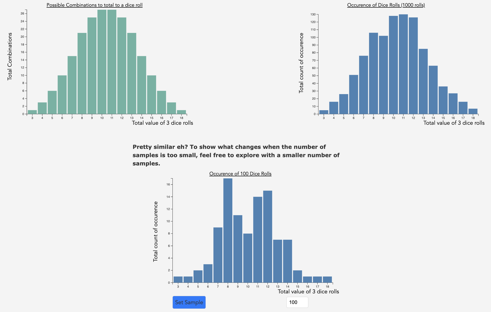

# The Great Normalizer: How the Central Limit Theorem Shapes Statistics

This project uses the Javascript D3 library to create a dynamic, interactive visualization of the Central Limit Theorem. 

The files in the [public](/public) directory are deployed to: https://cse442.pages.cs.washington.edu/25wi/fp/clt-statistics

## Motivation

The Central Limit Theorem (CLT) is a fundamental result in statitics. It asserts that the distribution of sample means will converge to a normal distribution, so long as the sample size is sufficiently high. Despite its relevance in many science and mathematical fields, many students struggle to grasp the intuition and core concepts.

For our CSE 442: Data Visualization Final Project, our group decided to create a series of visualizations on the Central Limit Theorem. Interactivity and simulation are effective educational tools, and our project aims to leverage them to teach these concepts to students. 

Here is an overview [video](https://youtu.be/mnmJQIoaBwo) showcasing our project! Feel free to check it out yourself!

## Visualizations

1. Importance of Sample Size

This simulation allows a user to enter a number of samples (below 1000) of three 6-sided dice and take the mean. Students will see that larger sample sizes more closely resemble the normal distribution.

2. Three Rules for the CLT

|  |  |
| :---: | :---: |
 
This interaction allows the user to select any of the three required rules of the CLT, and see how violating that rule affects the distribution.

3. CLT Equation

 
Users can hover over each variable in the CLT equation to pop-up a detailed explanation of what they mean.

4. CLT Simulation

 
The final visualization allows the user to create a probability distribution of their choosing for a 6-sided dice. They can then set the sample size (N) and number of samples. After clicking play, the computer randomly samples from the selected distribution, computes their means, and then plots them. Users should experiment and discover that as long as N is large, the plotted distribution looks approximately normal, regardless of the underlying distribution.

### Tools

HTML, CSS, Javascript (D3)

### Credit

**Creators**: Denny Zhou, Hisham Bhatti, Jason Hua, Denny Wu

With special thanks to Prof. Leilani Battle and the entire CSE 442 Winter 2025 Staff!
